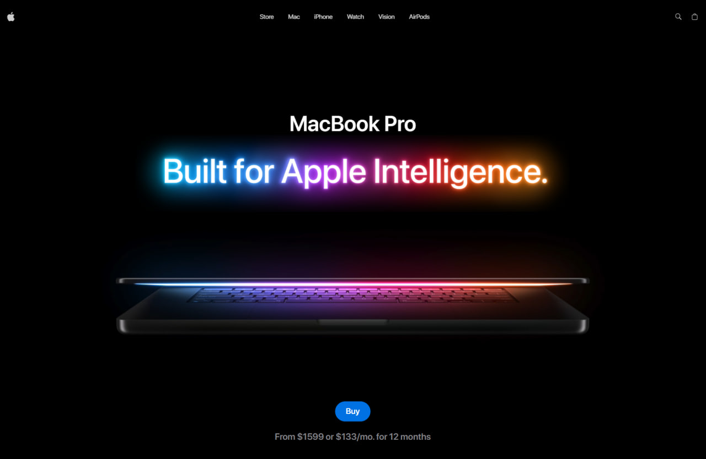

# 🍏 Apple MacBook Vision Experience

An immersive **Apple-style 3D product showcase** built with **React, Three.js, and GSAP** — replicating the elegant scroll-driven storytelling and motion design of Apple’s website.  
Experience seamless 3D interactions, cinematic animations, and video-textured realism.

---

## 🌐 Live Preview

🔗 [**View Demo**]([Link](https://beautiful-torrone-5ea809.netlify.app/))  

---

## 🖼️ Preview



---

## 🚀 Tech Stack

| Category | Technologies |
|-----------|--------------|
| **Core** | ⚛️ React 19, ⚡ Vite 7, 🧩 TypeScript 5.9 |
| **3D & Rendering** | 🌌 Three.js 0.179, 🧱 @react-three/fiber, 🎛️ @react-three/drei |
| **Animation** | 🌀 GSAP 3 + ScrollTrigger, 🧩 @gsap/react |
| **State Management** | 🧠 Zustand |
| **Styling** | 🎨 Tailwind CSS 4 |
| **Responsive Design** | 📱 react-responsive |

---

## ✨ Key Features

✅ **3D MacBook model** with realistic lighting and reflections  
✅ **Scroll-synced GSAP animations** controlling rotation and content transitions  
✅ **Dynamic video textures** synced with section reveals  
✅ **Optimized preloading** for GLTF model and all feature videos  
✅ **Cinematic motion design** inspired by Apple’s product pages  
✅ **Responsive scaling** and adaptive UI for mobile and desktop  
✅ **Smooth, composable animation timelines**

---

## 🧠 Project Structure

```bash
src/
├── components/
│   ├── Features.tsx
│   ├── Footer.tsx
│   ├── Hero.tsx
│   ├── Highlights.tsx
│   ├── ModelScroll.tsx
│   ├── Navbar.tsx
│   ├── Performance.tsx
│   ├── ProductViewer.tsx
│   └── ShowCase.tsx
│
├── components/models/
│   ├── Macbook.tsx
│   ├── Macbook-14.tsx
│   └── Macbook-16.tsx
│
├── components/three/
│   ├── ModelSwitcher.tsx
│   └── StudoLights.tsx
│
├── constants/               # Static data, feature definitions, positions
├── store/                   # Zustand global store for UI and model state
├── types/                   # Type definitions and shared interfaces
│
├── App.tsx                  # Root application with scroll containers
├── main.tsx                 # Entry point
└── index.css                # Tailwind base styles
---

## ⚙️ Installation & Setup

```bash
1️⃣ Clone the repository
git clone https://github.com/yourusername/apple-macbook-vision.git
cd apple-macbook-vision

2️⃣ Install dependencies
pnpm install

3️⃣ Run the development server
pnpm run dev


Then open http://localhost:5173


